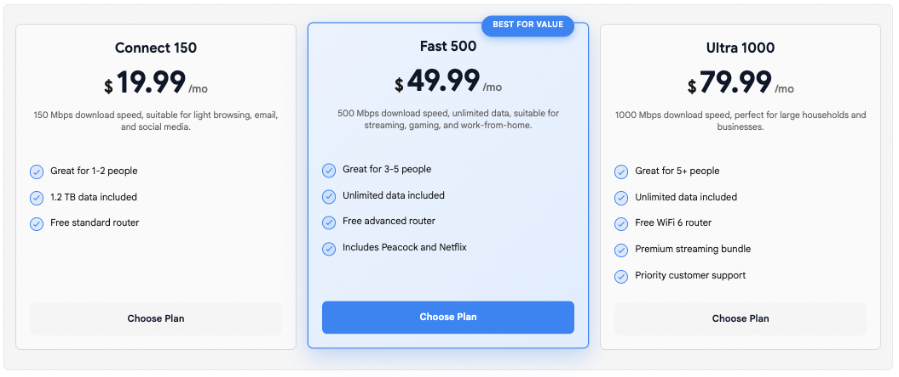
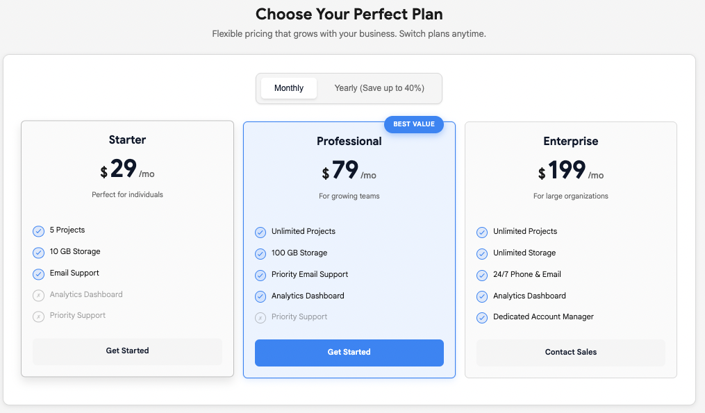
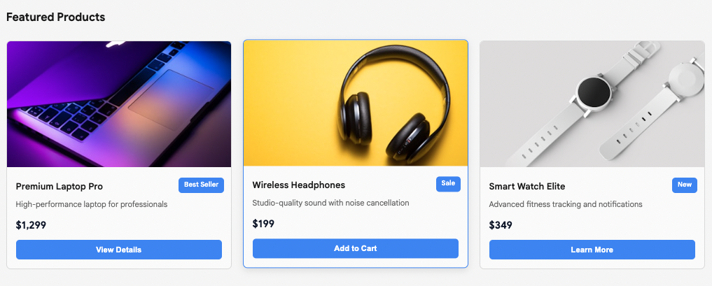
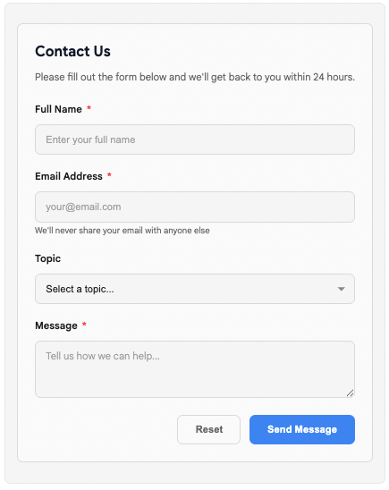
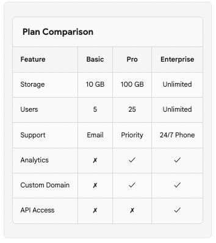
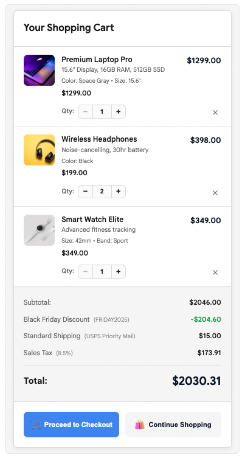
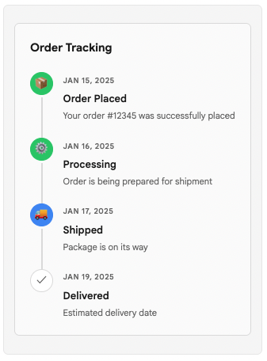
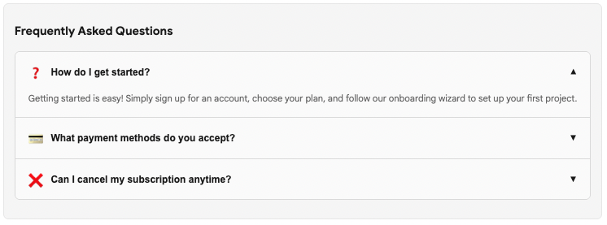
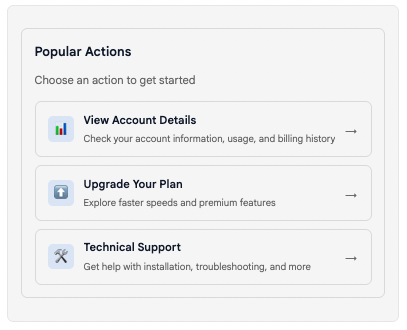

# ADK Web Plugins

[](LICENSE)
[](https://angular.dev)
[](https://www.typescriptlang.org/)

> Extensible plugin system for [Google ADK Web](https://github.com/google/adk-web) providing custom UI components and 13+ interactive widgets for building rich AI agent interfaces.

<div align="center">
  
  <p><em>Interactive widgets in action - Forms, Pricing Cards, Alerts, and more</em></p>
</div>

## Table of Contents

- [Overview](#overview)
- [Features](#features)
  - [Custom UI Components](#custom-ui-components)
  - [Interactive Widgets (14 total)](#interactive-widgets-14-total)
- [Installation](#installation)
  - [Prerequisites](#prerequisites)
  - [Quick Start](#quick-start)
  - [What the Installation Does](#what-the-installation-does)
  - [Manual Installation](#manual-installation)
- [Usage](#usage)
  - [Using Widgets in Your Agent](#using-widgets-in-your-agent)
  - [Widget Examples](#widget-examples)
- [Project Structure](#project-structure)
- [Configuration](#configuration)
  - [Plugin Registry](#plugin-registry)
  - [Widget Customization](#widget-customization)
- [Troubleshooting](#troubleshooting)
- [Verification & Testing](#verification--testing)
- [Uninstallation](#uninstallation)
- [Contributing](#contributing)
- [Compatibility](#compatibility)
- [Visual Showcase](#visual-showcase)
- [Acknowledgments](#acknowledgments)
- [Resources](#resources)
- [Support](#support)

## Overview

ADK Web Plugins is an external plugin package designed to enhance [ADK Web](https://github.com/google/adk-web) - Google's Agent Development Kit integrated developer interface. This package provides:

- **Custom Chat Panel** - Enhanced dark-themed chat interface with improved UX
- **Custom Markdown Renderer** - Specialized markdown rendering with ADK marker support
- **Widget System** - 13 pre-built interactive widgets (forms, pricing cards, alerts, and more)
- **Easy Installation** - Automated plugin installation with backup and rollback support
- **Type-Safe Integration** - Full TypeScript support for all components

## Features

### Custom UI Components

| Component | Description |
|-----------|-------------|
| **Custom Chat Panel** | Enhanced dark-themed chat interface with widget support, markdown rendering, and improved message handling |
| **Custom Markdown** | Advanced markdown renderer that strips ADK markers and provides consistent styling |

### Interactive Widgets (14 total)

| Widget | Use Case | Interactive |
|--------|----------|-------------|
| **Accordion** | FAQs, collapsible content sections | ✓ |
| **Alert** | Success/error/warning notifications | ✓ |
| **Card Grid** | Product listings, portfolios, content galleries | ✓ |
| **Carousel** | Image galleries, testimonials, slideshows | - |
| **Cart** | Shopping cart with items, pricing, checkout | ✓ |
| **Container** | Layout management, widget composition | - |
| **Form** | User input, surveys, data collection | ✓ |
| **Popup** | Modal dialogs, confirmations, nested content | ✓ |
| **Pricing Cards** | Subscription tiers, plans, product pricing | ✓ |
| **Quick Links** | Navigation shortcuts, CTAs, action buttons | ✓ |
| **Rating** | Star ratings, reviews, scores | ✓ |
| **Table** | Structured data display, comparisons | - |
| **Text** | Rich HTML content, formatted text | - |
| **Timeline** | Event history, progress tracking, chronology | - |

View detailed widget documentation in the [Widget System README](plugins/widgets/README.md).

## Installation

### Prerequisites

- Node.js 18 or higher
- A local installation of [ADK Web](https://github.com/google/adk-web)
- Basic knowledge of Angular 19+ and TypeScript

> **⚠️ Important:** This installation will add and modify files in your existing ADK Web project. It's strongly recommended to **backup your ADK Web directory** or **commit all changes to git** before proceeding with the installation.

### Quick Start

1. **Clone this repository:**
   ```bash
   git clone https://github.com/HiHelloAI/adk-web-plugins.git
   cd adk-web-plugins
   ```

2. **Install plugins into your ADK Web project:**
   ```bash
   node install-plugin.js /path/to/adk-web
   ```

3. **Verify installation:**
   ```bash
   ./verify-plugin.sh /path/to/adk-web
   ```

4. **Start ADK Web:**
   ```bash
   cd /path/to/adk-web
   npm run serve --backend=http://localhost:8000
   ```

### What the Installation Does

The `install-plugin.js` script automatically:

1. **Copies plugin files** → `src/app/plugins/`
2. **Updates main.ts** → Adds plugin provider imports and registration
3. **Updates styles.scss** → Includes widget base styles
4. **Updates chat.component.ts** → Integrates CustomChatPanelComponent

**Backups are created before all modifications:**
- `src/app/plugins.backup.[timestamp]/`
- `src/main.ts.backup.[timestamp]`
- `src/styles.scss.backup.[timestamp]`
- `src/app/components/chat/chat.component.ts.backup.[timestamp]`

### Manual Installation

If you prefer manual installation or need more control:

<details>
<summary>Show manual installation steps</summary>

1. **Copy plugin files:**
   ```bash
   cp -r plugins/* /path/to/adk-web/src/app/plugins/
   ```

2. **Update `src/main.ts`:**
   ```typescript
   import {getPluginProviders} from './app/plugins';

   bootstrapApplication(AppComponent, {
     providers: [
       // ... existing providers
       ...getPluginProviders(),
     ]
   })
   ```

3. **Update `src/styles.scss`:**
   ```scss
   @import './app/plugins/widgets/core/widget-base.scss';
   ```

4. **Update `src/app/components/chat/chat.component.ts`:**
   ```typescript
   // Add import
   import {CustomChatPanelComponent} from '../../plugins/custom-chat-panel/custom-chat-panel.component';

   // Add to @Component imports array
   @Component({
     imports: [
       // ... other imports
       CustomChatPanelComponent,
     ]
   })

   // Update viewChild
   chatPanel = viewChild.required(CustomChatPanelComponent);
   ```

</details>

## Usage

### Instructing LLMs to Generate Widgets

The most powerful way to use these widgets is by instructing your LLM (Large Language Model) to generate widget JSON when appropriate. Add instructions to your system prompt or agent configuration:

#### Basic Approach

Include in your system prompt:

> "When presenting pricing options, product listings, or subscription plans, format your response as a JSON widget using the 'pricing-cards' type. When collecting user information, use the 'form' widget type. When showing success/error messages, use the 'alert' widget type. Return ONLY the JSON widget without any markdown formatting."

#### Detailed Widget Instructions

For better results, provide specific widget schemas in your prompt:

```
Available Widgets:

1. PRICING CARDS - Use for subscription plans, product tiers, pricing options
   Format: {"type": "pricing-cards", "title": "...", "cards": [...]}

2. FORMS - Use for collecting user input, surveys, registrations
   Format: {"type": "form", "title": "...", "fields": [...]}

3. ALERTS - Use for notifications, success/error messages, warnings
   Format: {"type": "alert", "variant": "success|error|warning|info", "message": "..."}

4. CART - Use for shopping carts, order summaries, checkout flows
   Format: {"type": "cart", "items": [...], "total": ...}

5. TABLES - Use for structured data, comparisons, data grids
   Format: {"type": "table", "headers": [...], "rows": [...]}

When the user's request matches a widget use case, respond with ONLY the JSON widget (no markdown code blocks).
```

#### Example System Prompt

```
You are a helpful assistant with access to interactive widgets. When appropriate:

- Show pricing with pricing-cards widget
- Collect data with form widget
- Display notifications with alert widget
- Show shopping carts with cart widget
- Present data tables with table widget

Return widget JSON directly without markdown formatting. The frontend will automatically detect and render valid JSON widgets.
```

### How It Works

1. **LLM generates widget JSON** based on the context and your instructions
2. **Backend returns JSON string** in the message content
3. **Frontend automatically detects** valid JSON that matches widget schemas
4. **Widget renders** in place of plain text

This approach allows your LLM to dynamically choose the best widget type based on the user's request, creating rich interactive experiences without hardcoding widget logic.

### Widget Examples

#### Pricing Cards with Tabs and Discounts

```json
{
  "type": "pricing-cards",
  "title": "Choose Your Perfect Plan",
  "subtitle": "Flexible pricing that grows with your business",
  "columns": 3,
  "tabs": [
    {
      "id": "monthly",
      "label": "Monthly Billing",
      "cards": [
        {
          "id": "pro_monthly",
          "title": "Professional",
          "description": "For growing teams",
          "badge": "Most Popular",
          "featured": true,
          "price": {
            "currency": "$",
            "amount": "79",
            "period": "/month"
          },
          "features": [
            {"text": "100 GB Storage", "enabled": true},
            {"text": "25 Team Members", "enabled": true},
            {"text": "Priority Support", "enabled": true}
          ],
          "cta": {"text": "Start Free Trial"}
        }
      ]
    },
    {
      "id": "yearly",
      "label": "Yearly Billing (Save 25%)",
      "cards": [
        {
          "id": "pro_yearly",
          "title": "Professional",
          "description": "For growing teams",
          "badge": "Best Value",
          "featured": true,
          "price": {
            "currency": "$",
            "amount": "59",
            "period": "/month",
            "originalAmount": "79",
            "discountBadge": "Save 25%"
          },
          "features": [
            {"text": "100 GB Storage", "enabled": true},
            {"text": "25 Team Members", "enabled": true},
            {"text": "Priority Support", "enabled": true}
          ],
          "cta": {"text": "Subscribe Yearly"}
        }
      ]
    }
  ]
}
```

#### Interactive Form

```json
{
  "type": "form",
  "title": "Get Started",
  "description": "Fill out this form to create your account",
  "fields": [
    {
      "type": "text",
      "name": "fullName",
      "label": "Full Name",
      "required": true,
      "placeholder": "John Doe"
    },
    {
      "type": "email",
      "name": "email",
      "label": "Email Address",
      "required": true,
      "helperText": "We'll never share your email"
    },
    {
      "type": "select",
      "name": "plan",
      "label": "Choose Plan",
      "options": [
        {"value": "basic", "label": "Basic"},
        {"value": "pro", "label": "Professional"}
      ]
    }
  ],
  "submitText": "Create Account",
  "actionsAlign": "right"
}
```

For more widget examples, see the [Widget System Documentation](plugins/widgets/README.md).

## Project Structure

```
adk-web-plugins/
├── plugins/                          # Plugin source files
│   ├── custom-chat-panel/           # Enhanced chat interface
│   │   ├── custom-chat-panel.component.ts
│   │   ├── custom-chat-panel.component.html
│   │   ├── custom-chat-panel.component.scss
│   │   └── custom-markdown.component.ts
│   ├── widgets/                     # Widget system
│   │   ├── core/                    # Core widget infrastructure
│   │   │   ├── widget-models.ts    # Type definitions
│   │   │   ├── widget-renderer.component.ts
│   │   │   ├── widget-base.scss    # Shared styles
│   │   │   └── widget-demo-data.ts # Demo examples
│   │   ├── pricing-cards/          # Individual widgets...
│   │   ├── form/
│   │   ├── alert/
│   │   └── ... (13 widget types)
│   ├── index.ts                     # Plugin exports
│   └── plugin-registry.ts           # Plugin registration
├── install-plugin.js                # Automated installer
├── verify-plugin.sh                 # Installation verifier
├── extract-widgets.sh               # Widget discovery tool
├── package.json                     # Package metadata
├── LICENSE                          # Apache 2.0 License
├── README.md                        # This file
└── CONTRIBUTING.md                  # Contribution guidelines
```

## Configuration

### Plugin Registry

The plugin system uses a centralized registry in [plugins/plugin-registry.ts](plugins/plugin-registry.ts). To add new plugins:

```typescript
export function getPluginProviders(): Provider[] {
  const providers: Provider[] = [];

  // Register your custom component
  providers.push({
    provide: SomeADKComponent,
    useClass: YourCustomComponent,
  });

  return providers;
}
```

### Widget Customization

To customize widget appearance, modify [plugins/widgets/core/widget-base.scss](plugins/widgets/core/widget-base.scss). Available CSS variables:

```scss
.widget-root {
  --widget-background: hsl(var(--background));
  --widget-foreground: hsl(var(--foreground));
  --widget-primary: hsl(var(--primary));
  --widget-border: hsl(var(--border));
  --widget-radius: 8px;
  --widget-spacing-sm: 8px;
  --widget-spacing-md: 16px;
  // ... more variables
}
```

## Troubleshooting

### Common Issues

<details>
<summary><b>Build Error: "Multiple components match"</b></summary>

Ensure only `CustomChatPanelComponent` is in the @Component imports array, not `ChatPanelComponent`.

**Fix:**
```typescript
@Component({
  imports: [
    CustomChatPanelComponent,  // ✓ Correct
    // ChatPanelComponent,     // ✗ Remove this
  ]
})
```
</details>

<details>
<summary><b>Build Error: "Child query result is required"</b></summary>

Update the viewChild reference from `ChatPanelComponent` to `CustomChatPanelComponent`.

**Fix:**
```typescript
// Before
chatPanel = viewChild.required(ChatPanelComponent);

// After
chatPanel = viewChild.required(CustomChatPanelComponent);
```
</details>

<details>
<summary><b>Widgets not rendering</b></summary>

- Verify widget type matches exactly (case-sensitive)
- Check data structure matches widget model interface
- Ensure JSON is valid (use [JSONLint](https://jsonlint.com/))
- Check browser console for errors
</details>

<details>
<summary><b>Plugin installation fails</b></summary>

Run the verification script to diagnose issues:

```bash
./verify-plugin.sh /path/to/adk-web
```

Check that:
- ADK Web path is correct
- `src/main.ts` exists
- You have write permissions
</details>

## Verification & Testing

### Verify Installation

```bash
./verify-plugin.sh /path/to/adk-web
```

The script checks:
- ✓ Plugin files copied correctly
- ✓ `main.ts` has plugin imports
- ✓ `styles.scss` includes widget styles
- ✓ `chat.component.ts` uses CustomChatPanelComponent

### Extract Widget Information

```bash
./extract-widgets.sh
```

Outputs detailed information about all available widgets.

### Testing in Demo Mode

ADK Web plugins include a demo mode with 20+ pre-built widget examples:

1. Start ADK Web with plugins installed
2. Click the **"Demo"** button in the chat interface
3. Browse through all widget types and interactions
4. Click "Demo" again to restore original messages

## Uninstallation

To remove the plugins:

1. **Remove plugin files:**
   ```bash
   cd /path/to/adk-web
   rm -rf src/app/plugins
   ```

2. **Restore from backup** (if needed):
   ```bash
   mv src/app/plugins.backup.[timestamp] src/app/plugins
   mv src/main.ts.backup.[timestamp] src/main.ts
   mv src/styles.scss.backup.[timestamp] src/styles.scss
   ```

3. **Manually remove imports** from:
   - `src/main.ts` - Remove `getPluginProviders()` import and call
   - `src/styles.scss` - Remove widget-base.scss import
   - `src/app/components/chat/chat.component.ts` - Revert to `ChatPanelComponent`

## Contributing

We welcome contributions! Please see our [Contributing Guide](CONTRIBUTING.md) for details on:

- Code of conduct
- Development setup
- Creating new widgets
- Submitting pull requests
- Coding standards

### Quick Contribution Steps

1. Fork the repository
2. Create a feature branch: `git checkout -b feature/your-feature`
3. Make your changes with tests
4. Commit with descriptive messages
5. Push and create a pull request

## Compatibility

| Package | Version |
|---------|---------|
| ADK Web | 1.0.0+ |
| Angular | 19.x |
| Node.js | 18+ |
| TypeScript | 5.x |

## Visual Showcase

### Pricing Cards Simple


### Pricing Cards With Tabs


### Pricing Cards With Image


### Interactive Forms


### Grid


### Cart


### Timeline


### Accordion


### Action


## Acknowledgments

- **Built for [Google ADK Web](https://github.com/google/adk-web)** - This is a community plugin package, not an official Google project
- Built with [Angular](https://angular.dev) framework
- Styled with [Angular Material](https://material.angular.io)
- Licensed under Apache 2.0 for compatibility with ADK Web

## Resources

- [ADK Web Documentation](https://github.com/google/adk-web)
- [Widget System Guide](plugins/widgets/README.md)
- [Contributing Guidelines](CONTRIBUTING.md)
- [Issue Tracker](https://github.com/HiHelloAI/adk-web-plugins/issues)

## Support

- **Bug Reports:** [GitHub Issues](https://github.com/HiHelloAI/adk-web-plugins/issues)
- **Questions:** [GitHub Discussions](https://github.com/HiHelloAI/adk-web-plugins/discussions)
- **Documentation:** See [Widget README](plugins/widgets/README.md)

---

Made with ❤️ for the ADK Web community
